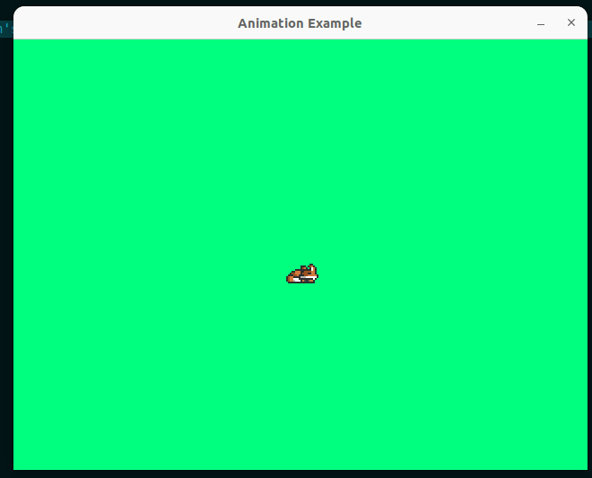

# Ebiten Animation Example

> The code needs some clean up and probably a little refactoring. The Sprite probably shouldn't be responsible for animating itself but 🤷. 
> There should probably be an animator interface that is used to play seperate animations on different sprites given a set of parameters. 

A sprite animation example using Ebitengine.

See source code for implementation.

Sprite was created by [Elthen's Pixel Art Shop](https://itch.io/profile/elthen).

